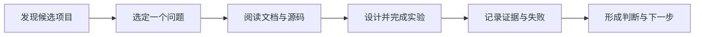

<div align="center">

# AI 技术学习仓库

**每天认真研究一个 AI 项目，把看到的新技术变成自己真正理解、试过、能判断的知识。**

聚焦 AI Agent、RAG、金融 AI、漫剧与视频创作。记录从发现项目、阅读资料、动手实验到复盘判断的全过程。

[使用每日学习 Skill](.agents/skills/ai-daily-deep-study/SKILL.md) · [阅读第一篇深度日报](daily/2026/10/2026-10-07.md) · [查看每日笔记](daily/README.md) · [查看周报目录](weekly/README.md) · [使用写作模板](templates/daily-note-template.md)

</div>

---

## 这里记录什么

GitHub 上每天都有新项目。这个仓库用一个固定的问题来筛选它们：**这项技术解决了什么问题，我能否通过阅读和试用验证它？**

我会关注以下方向，但不会为了覆盖所有方向而凑数量：

| 方向 | 关注的问题 |
| --- | --- |
| AI Agent 与 RAG | Agent 如何使用工具、保存记忆、检索知识并完成复杂任务？ |
| 金融 AI | 新技术能否帮助研究、风控、投研或业务流程？落地条件是什么？ |
| 漫剧与视频 | 生成质量、角色一致性、制作流程和生产效率有什么变化？ |
| 通用 AI 工具 | 哪些能力值得亲自试用，哪些还需要继续观察？ |

每篇日报只选 **1 个项目** 深入研究；每周再从实际阅读和实验中提炼值得长期关注的变化。

## 从这篇开始

### 2026-10-07 · claude-mem：给 AI Agent 加一层跨会话记忆

[阅读全文 →](daily/2026/10/2026-10-07.md)

这篇记录了我在 Codex 中安装和试用 [claude-mem](https://github.com/thedotmack/claude-mem) 的全过程：理解 Hooks、Worker、SQLite 与 Chroma 的关系；排查 Hooks 未生效和首次语义模型下载超时；再用新任务验证跨会话召回。

**这次实验最重要的发现：** 历史记录能被找回，回答仍可能引用已经过时的记录。可靠的 AI 记忆需要同时处理相关性、时间顺序和新旧状态冲突。

> 周报目录和模板已经建立。第一份周报会在有足够的每日观察后整理发布。

## 我的研究方法



一篇日报通常回答六个问题：

1. **为什么选它？** 它解决的问题是什么，为什么值得花时间？
2. **它如何工作？** 核心组件、输入输出和技术链路是什么？
3. **我验证了什么？** 试用目标、步骤和成功标准是什么？
4. **实际发生了什么？** 哪些结果被证实，哪些地方失败或尚未验证？
5. **对产品有什么启发？** 适用场景、门槛、成本与风险是什么？
6. **下一步做什么？** 继续试验、跟踪更新，还是暂时停止投入？

记录时会区分 **官方说明、个人理解、实验事实**。结论发生变化时，保留排查过程，并在新记录中说明最新状态。

## 用 Skill 一步一步完成每日学习

仓库内的 [每日 AI 技术深度学习 Skill](.agents/skills/ai-daily-deep-study/SKILL.md) 把这套方法做成了可重复的对话引导。它不会一上来代写一篇“看起来很完整”的日报，而是陪你完成选题、阅读、动手验证、核对证据和复盘。每天只深挖一个项目，先学会，再写下来。

在 Codex 中打开本仓库，输入 `$ai-daily-deep-study`，例如：

> `$ai-daily-deep-study 今天我想研究一个 GitHub 上的 AI 项目。请先帮我筛选，再一步一步带我读文档、做小实验，最后整理日报。`

如果已经有项目链接，也可以直接说：“`$ai-daily-deep-study` 我选了这个仓库，请从阅读开始带我学。”Skill 会从你实际所在的步骤继续，复用 [日报模板](templates/daily-note-template.md)，将已验证的内容保存到 `daily/YYYY/MM/YYYY-MM-DD.md`。使用其他支持仓库级 Skill 的工具时，请先确认其发现和调用方式。

## 仓库导航

| 位置 | 内容 | 从这里开始 |
| --- | --- | --- |
| [`daily/`](daily/README.md) | 每天一个项目的深度阅读与试用 | [2026-10-07 · claude-mem](daily/2026/10/2026-10-07.md) |
| [`weekly/`](weekly/README.md) | 每周技术变化与产品机会的归纳 | [周报说明](weekly/README.md) |
| [`templates/`](templates/) | 日报与周报的写作框架 | [日报模板](templates/daily-note-template.md) · [周报模板](templates/weekly-report-template.md) |
| [`.agents/skills/`](.agents/skills/ai-daily-deep-study/SKILL.md) | 每日学习与写作的项目级引导 Skill | [查看 Skill](.agents/skills/ai-daily-deep-study/SKILL.md) |

```text
AI-Tech-Learning/
├── daily/                 每日深度研究
│   └── 2026/10/
│       └── 2026-10-07.md
├── weekly/                每周趋势归纳
├── templates/             可复用的日报和周报模板
├── .agents/skills/        项目级每日学习 Skill
└── README.md              仓库首页与阅读入口
```

## 如果你也想按这个方式学习

1. 从 [GitHub Trending](https://github.com/trending)、项目 Release 或官方文档里发现候选项目。
2. 选出当天最想弄懂的 **一个技术问题**，再决定研究哪个项目。
3. 复制 [单项目深度日报模板](templates/daily-note-template.md)，先写下实验目标，再动手试用。
4. 把真实结果、错误信息和证据链接留在笔记里；没有验证的部分明确写“待验证”。
5. 到周末回看每日结论，用 [周报模板](templates/weekly-report-template.md) 提炼共性和产品机会。

这个仓库会随着我的实际研究持续更新。如果你对某篇笔记有不同的技术判断，欢迎通过 [Issues](https://github.com/yilin6868/AI-Tech-Learning/issues) 讨论，并附上资料或复现实验。

本仓库采用 [MIT License](LICENSE) 开源；复用 Skill 或模板时请保留版权与许可声明。
