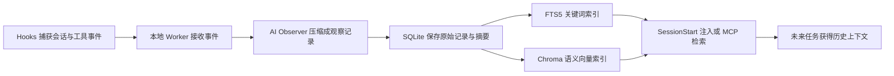

# 2026-10-07 AI 技术深度日报｜claude-mem：给 AI Agent 加一层跨会话记忆

> 今日只研究一个项目：`thedotmack/claude-mem`。这不是一篇项目介绍的摘抄，而是一次从阅读、安装、失败排查到跨任务召回验证的完整记录。

## 今日结论

- **今日项目**：[thedotmack/claude-mem](https://github.com/thedotmack/claude-mem)
- **所属方向**：AI Agent、长期记忆、上下文工程、RAG
- **一句话理解**：它通过 Hooks 自动捕获 AI Agent 的工作过程，压缩成结构化观察记录，再在未来会话中按需检索或注入上下文。
- **我的判断**：值得试用，也值得持续跟踪；但它不是“装上就永远不会忘”的魔法插件，实际效果取决于捕获、压缩、索引、检索和答案生成五个环节。
- **今天最重要的收获**：**记忆被成功存储和检索，不等于最终答案一定正确。新旧记录冲突时，AI 还必须判断哪一条代表当前状态。**

## 为什么今天选择它

我今天在 GitHub 项目中选择了 claude-mem，而没有同时研究多个项目，原因有三个：

1. 它对应的是一个真实而普遍的问题：AI Agent 换一个任务或重新打开会话后，容易丢失之前的工作背景。
2. 它不只是一个概念仓库，而是可以安装、配置并设计实验验证的完整系统。
3. 它和我现在的学习方式直接相关：如果记忆系统可靠，AI 就能持续记住日报结构、研究过程、失败经验和个人判断。

截至 2026-10-07，GitHub 页面显示该项目约有 **97.2k Stars、8.6k Forks**，采用 **Apache-2.0** 许可证。热度只能说明关注度高，不能代替技术判断，所以今天的重点是亲自安装和验证。

## 它到底是项目，还是 Skill

claude-mem 首先是一个完整的开源项目和本地记忆系统，不只是一个 Skill。

安装后，它会提供：

- 用于监听会话生命周期的 Hooks；
- 一个常驻本地的 Worker 服务；
- 保存会话、提示词、观察记录和摘要的 SQLite 数据库；
- 用于语义搜索的 Chroma 向量库；
- `mem-search` 等 Skills 和 MCP 搜索工具；
- 用于查看实时记忆的本地 Web 界面。

所以，更准确的关系是：

> **claude-mem 是完整系统，mem-search 是这个系统对 AI 暴露出来的一种使用能力。**

## 我对技术链路的理解

这条链路可以拆成五层：

1. **捕获层**：`SessionStart`、`UserPromptSubmit`、`PreToolUse`、`PostToolUse`、`Stop` 等 Hooks 获取会话事件。
2. **处理层**：Worker 把事件排队，交给 AI Observer 提炼成较短的 observations 和 summaries。
3. **存储层**：SQLite 保存结构化记录，FTS5 提供全文关键词检索。
4. **语义索引层**：Chroma 和嵌入模型把文本转成向量，让不同说法也能互相匹配。
5. **召回层**：新会话可以自动收到相关上下文，也可以通过 `search → timeline → get_observations` 主动查询。

我原本以为它只是“把聊天记录存起来”，实际理解后发现，它更接近一个面向 AI Agent 的小型数据管道：**事件采集 + AI 压缩 + 数据库存储 + 混合检索 + 上下文注入**。

## 本次试用环境

- 使用端：Codex
- claude-mem 版本：`13.34.2`
- 记忆生成 Provider：Codex CLI subscription
- 本地 Worker 端口：`37701`
- 本地数据目录：`~/.claude-mem/`
- 匿名遥测：已关闭
- Hooks：已人工信任

关闭匿名遥测不会关闭本地记忆功能。它影响的是项目方收集匿名使用信息，不影响 Hooks、SQLite、Worker 或 Chroma 的核心链路。

## 实验目标与设计

我没有把“安装成功”当作测试完成，而是设计了一个跨任务实验：

1. 在任务 A 中写入只有当前实验才知道的信息。
2. 结束任务 A，新建任务 B。
3. 在任务 B 中要求 claude-mem 找回之前的信息。
4. 检查它到底来自本地记忆数据库，还是模型根据当前聊天内容猜出来的。
5. 再用不包含原关键词的同义句测试语义召回。
6. 最后制造新旧记录冲突，验证它是否会优先采用最新状态。

这个实验比“能搜到一句话”更严格，因为它同时检查了：

- 是否真正跨任务；
- 是否真正写入数据库；
- 是否具备语义匹配；
- 是否能够处理记录的时效性。

## 实验过程：从假成功到真正成功

| 阶段 | 现象 | 判断 |
| --- | --- | --- |
| 第一次跨任务测试 | 找回了测试代号，但总耗时 8 分 57 秒 | **不算真正成功**：当时 claude-mem 查询超时且本地索引为空，答案来自上一条测试任务文本的核对 |
| 检查数据库 | observations、sessions 等关键表最初为空 | Hooks 没有真正执行 |
| 信任 Hooks | 新会话和用户提示开始进入数据库，日志出现 `Session initialized` 与队列记录 | 捕获链路恢复 |
| 第一次语义搜索 | Chroma 预热多次在 120 秒后中止 | 首次依赖尚未完整下载，插件超时上限短于实际下载时间 |
| 手动完成依赖预热 | `uvx` 完成 109 个包的安装 | Chroma 运行环境准备完成 |
| 下载嵌入模型 | `all-MiniLM-L6-v2` 模型包增长到约 83 MB 并完成解压 | 语义模型准备完成 |
| 重启 Worker | `chroma-mcp` 成功连接，历史记录开始回填 | 旧熔断状态被清除 |
| 同义句测试 | “插件钩子已经获得用户许可”成功找回“Hooks 已信任” | 证明不是单纯关键词匹配 |
| 最终检索耗时 | 单次语义召回约 **348 ms** | Chroma 搜索恢复正常 |
| 第一次完整回答 | 跨任务回答总耗时 2 分 53 秒，但引用旧记录，错误地说模型仍在下载 | 检索成功，但答案生成阶段忽略了最新状态 |
| 第二次完整回答 | 明确要求按时间从新到旧并优先读取最新 bugfix 后，正确引用 #9 和 #11 | 新旧状态冲突得到正确处理 |

## 两个真正的故障分别是什么

### 1. Hooks 没有被信任

安装插件不代表 Hook 会自动获得执行权限。Codex 在未信任第三方 Hook 时会跳过执行，因此界面上看起来“插件已经安装”，数据库却没有收到实际会话内容。

这个问题的启发是：

> **安装状态、启用状态和运行状态必须分开验证。**

对于任何 Agent 插件，都不能只看“已安装”按钮，还要观察事件是否触发、数据库是否增长、日志是否出现真实处理记录。

### 2. Chroma 首次初始化超过插件超时时间

Chroma 第一次启动需要准备 Python 环境、安装 `chromadb`、`onnxruntime`、`grpcio` 等依赖，并下载默认嵌入模型。当前网络速度下，这些步骤超过了插件每次 120 秒的预热上限，于是发生了“下载一点—超时—下次继续”的循环。

解决方法不是反复发起搜索，而是：

1. 单独执行一次完整预热，让依赖缓存真正落地；
2. 等待嵌入模型下载和解压完成；
3. 重启 Worker，清除连续失败形成的熔断状态；
4. 用同义句而不是原关键词验证语义搜索。

## 最有价值的意外发现：检索成功不等于回答正确

第一次正式跨任务回答已经成功找到了多条历史观察记录，但它引用了较旧的 #1、#6、#8，遗漏了最新的 bugfix #9，于是沿用了“模型仍在下载”的过时结论。

第二次测试增加了三个约束：

- 按时间从新到旧搜索；
- 必须读取最新的 bugfix；
- 新旧记录冲突时以最新记录为准。

加入这些约束后，系统给出了正确结论：Chroma 已修复、模型已完成预热、单次语义召回为 348 ms；上次回答错误是证据选择过时，而不是 Chroma 再次故障。

这让我第一次真正理解了长期记忆系统的一个核心难点：

> **“找到相关内容”只解决了相关性；要得到可靠答案，还必须解决新鲜度、状态覆盖和证据冲突。**

在产品设计中，不能只用 Recall 或命中率评价记忆系统，还要关注：

- 最新记录是否能覆盖旧状态；
- 回答是否展示记录时间和 observation ID；
- 事实发生变化时是否有 superseded（已被取代）机制；
- 召回到冲突证据时是否会主动核对；
- 用户能否看见检索耗时与整条调用链。

## `search → timeline → get_observations` 为什么有必要

claude-mem 没有一开始就把所有完整记忆塞给模型，而是采用渐进式读取：

1. `search`：先返回标题、时间、类型和 ID，快速缩小范围；
2. `timeline`：查看目标记录前后发生了什么；
3. `get_observations`：只读取最终选中的完整记录。

它解决的是上下文成本问题。完整观察记录可能很长，如果每次搜索都全部展开，会迅速消耗模型上下文。先看索引、再看时间线、最后读取少量正文，更接近人类查档案的方式。

但今天的实验也证明：渐进式披露会把“选哪条记录”的责任交给 Agent。如果第一步筛选错了，后面的完整阅读再准确也没有用。

## 对 AI 产品经理的启发

### 1. 记忆产品不是一个数据库功能

一个可用的 Agent Memory 至少需要：

- 采集策略：什么值得记，什么不该记；
- 压缩策略：如何从工具调用中提取可复用事实；
- 检索策略：关键词、向量、时间和项目范围如何组合；
- 冲突策略：旧状态与新状态同时存在时采用哪条；
- 隐私策略：敏感内容如何排除、删除或限制传播；
- 可观测性：用户如何知道“没记住”发生在哪一层。

### 2. “记得多”不一定比“记得准”更好

如果系统保存了大量中间故障，却没有明确哪条记录代表最终状态，更多记忆反而会增加误判。高质量记忆系统应该能区分：过程记录、阶段结论和最终结论。

### 3. 性能需要分层测量

今天出现了三个不同的时间：

- 首次失败测试：8 分 57 秒；
- 最终单次语义检索：348 ms；
- Agent 完成多轮搜索、时间线核对和回答生成：2～4 分钟。

只看总耗时会误以为向量库仍然很慢；只看 348 ms 又会忽略用户实际等待。产品上必须同时监测检索耗时、工具链耗时和端到端耗时。

## 适合与不适合的场景

### 适合

- 跨多天开发同一个代码仓库；
- 持续积累项目决策、Bug 原因和修复记录；
- 需要 AI 在新任务中快速了解历史背景；
- 长期研究同一技术方向并反复回顾；
- 希望把 Agent 的工作过程沉淀为可查询知识库。

### 暂时不适合

- 只进行一次性的短问答；
- 对本地安装、后台进程和依赖排查完全无法接受；
- 数据极度敏感，却没有先设计排除与审计策略；
- 希望系统对所有历史事实自动完成可靠的版本管理；
- 对端到端响应时间要求非常严格的实时任务。

## 我的最终判断

**结论：值得试用，并进入 7 天持续观察。**

claude-mem 已经证明它能在 Codex 中完成真正的跨任务记忆和语义召回。它的技术价值不在于“保存聊天记录”，而在于把 Agent 工作过程转换成未来可以搜索的结构化经验。

但它仍有三个需要继续观察的点：

1. 首次安装和语义模型初始化的体验是否足够稳定；
2. 长时间使用后，旧观察记录是否会干扰当前判断；
3. Agent 的端到端召回速度能否从分钟级进一步下降。

因此，我不会把今天的结论写成“已经完全解决 AI 遗忘问题”，而是：

> claude-mem 已经具备可用的跨会话记忆链路，但要成为可靠的生产能力，还需要更好的状态更新、冲突处理和性能可观测性。

## 下一步实验

- [ ] 连续 7 天在本仓库中使用 claude-mem，观察它能否记住日报写作原则。
- [ ] 下次不告诉它具体文件名，测试它能否找回今天的核心结论。
- [ ] 制造一次“旧结论被新结论推翻”的场景，观察是否仍需人工提示按时间排序。
- [ ] 记录每次底层搜索耗时和端到端回答耗时，避免混为一谈。
- [ ] 周末把 claude-mem 放入本周周报的“Agent Memory / 上下文工程”栏目。

## 资料来源

- [claude-mem GitHub 仓库](https://github.com/thedotmack/claude-mem)
- [Architecture Overview](https://docs.claude-mem.ai/architecture/overview)
- [Hooks Architecture](https://docs.claude-mem.ai/hooks-architecture)
- [Search Architecture](https://docs.claude-mem.ai/architecture/search-architecture)
- [Memory Search](https://docs.claude-mem.ai/usage/search-tools)
- [Configuration](https://docs.claude-mem.ai/configuration)

